---
hide:
  - navigation
---

# Private Cloud
## Big Picture
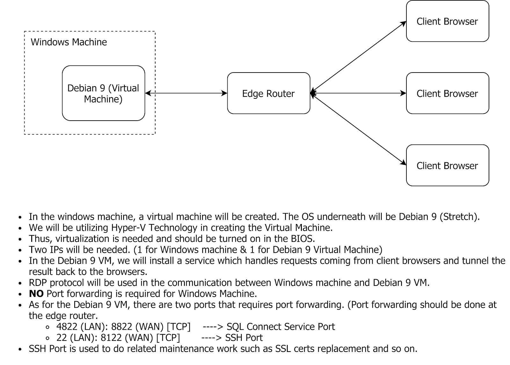

---
## Quick Checklist
1. Make sure the client has fiber internet (**MAXIS**, **UNIFI**, **TIME**). (**STRICTLY NO STREAMYX/BROADBAND/UNIFI LITE**)
2. Will need 2 IP Address. (1 for Windows & 1 for Debian 9 Virtual Machine) 
	- If no special requirements, may leave it empty in the checklist. We will assign them accordingly.
3. Port forwarding will be done on the Debian 9 VM.
	- If not sure how to configure this, may leave it empty in the checklist. We will help in configuring it.
4. Enable virtualization in the BIOS. Here's how you can check if you have enabled it.
  
    [Check BIOS Virtualization](https://www.trishtech.com/wp/wp-content/uploads/2017/08/check-virtualization-2.jpg)

5. If it is not enabled, you may need to enter BIOS to switch it on. Here's how you can enter your server's BIOS.

	[Enter BIOS](https://www.laptopmag.com/articles/access-bios-windows-10)

6. Enable Hyper-V after the above has been done.
	
    [Enable Hyper-V Manager](https://www.nextofwindows.com/how-to-enable-configure-and-use-hyper-v-on-windows-10)

7. Get **Dynamic DNS (DDNS)/ Fixed WAN IP** ready.
8. If you are getting one from *NO-IP*, you may set it up using the client provided. Here's how.
	  
    [NO-IP Dynamic Update Client](https://www.noip.com/download?page=win)

9. Make sure the server has **Ethernet** connection.
	(STRICTLY NO WIFI IS ALLOWED)
10. Download and install Firebird Server.
	
    [Firebird Downloads](https://firebirdsql.org/en/firebird-3-0-6/)

11. Make sure there is no antivirus other than Windows Defender.
12. Fill in the checklist and send it to us.
	
    [Checklist](https://docs.google.com/spreadsheets/d/1iqCgQMDHGcTYtt0HSgAsEAPTED1eltnQj8ywJdwYYx0/edit?usp=sharing)

---
## Prerequisites (Detailed Information)
### Network
1. Make sure to have fiber network (not streamyx, broadband & unifi lite) / low latency internet access. (ping below 20ms)
2. Reserve 2 IP Address: 1 for Windows & 1 for Debian virtual machine.
3. Must have wired network connection/Ethernet.
4. Will do port forwarding pointing towards the Debian machine as below:
	```
	8822[WAN] : 4822[LAN]
	8122[WAN] : 22[LAN]
	
	Both entries are in TCP mode.
	NO PORT FORWARDING ON THE WINDOWS.
	```
1. Have a ready dynamic DNS (DDNS) / Fixed WAN IP Address.

### Hardware
1. CPU model not older than Intel i5 (5th generation) or AMD Ryzen 5. 
2. RAM should be at least 8GB.
3. Make sure CPU Virtualization is enabled in the BIOS.
4. We encourage users to switch on the PC for 24/7 so that maintenance work can be carried out without interferring users' work during work time.
5. Must have Solid State Drive (**SSD**).

### Operating System
1. Windows Defender did it's job pretty well in protecting/securing your server. No **third party antivirus** should be installed in the server.

    >Explanation:<br>
    Third party antivirus including avast, avira, kaspersky and so on have different behavior. Each of them acts differently towards SQL Connect setup.Besides, if these antivirus update and breaks SQL Connect dependencies, it will take a long time for us to debug and resolve before your service back online. The windows antivirus (Windows Defender) has became very mature and is sufficient in securing your server.

2. If you have used/installed serverlink in the server before, kindly reformat your server.
3. During the setup, automatic **Windows Update** will be disabled. However, users still able to update by clicking on the update in the settings.
4. SQL Connect only support **Windows 10 Professional** (version 1709, 1803, 1809) or **Windows Server 2016** (Essential Edition and above).
	- The version mentioned above supports unlimited concurrent users.
	- Others will have a limit of 15 concurrent users login at once.
5. Enable Hyper-V Virtualization.

  	[Enable Hyper-V Virtualization](https://docs.microsoft.com/en-us/virtualization/hyper-v-on-windows/quick-start/enable-hyper-v)
	
---
## SQL Connect Detector
- SQL Connect Detector is an application for verifying/troubleshooting private cloud.
- If you want to check if your server is **eligible** for setup, you may click on **Examination**.
- If you have a ready private cloud server, and **have issue** connecting to your server, you may click on **Troubleshooting** to run analysis on your system.
- You can download it from [SQL Connect Detector (SQL Drive)](https://drive.sql.com.my/s/rqRfFy8YMbckmA9)

	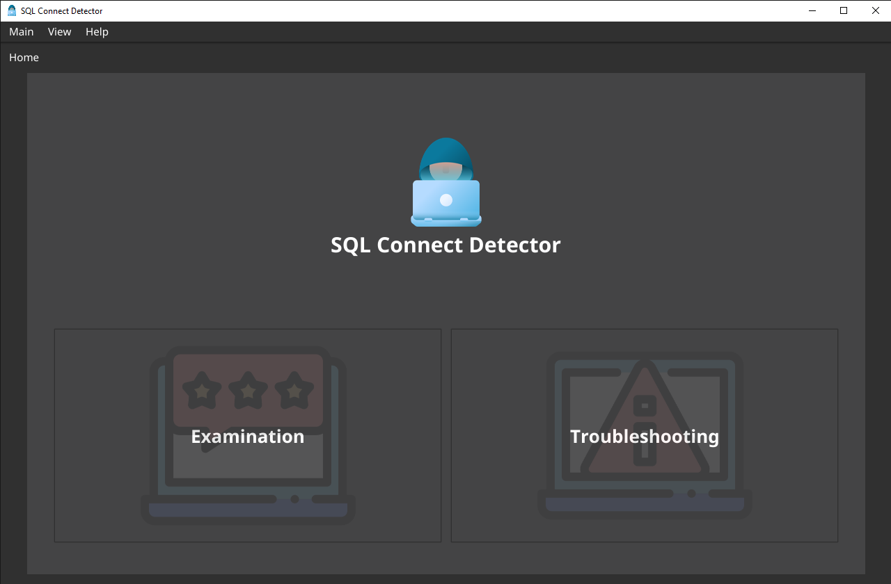
	
### Examination
- You may enter your **dynamic DNS (DDNS)** / **fix Public IP Address** here.

	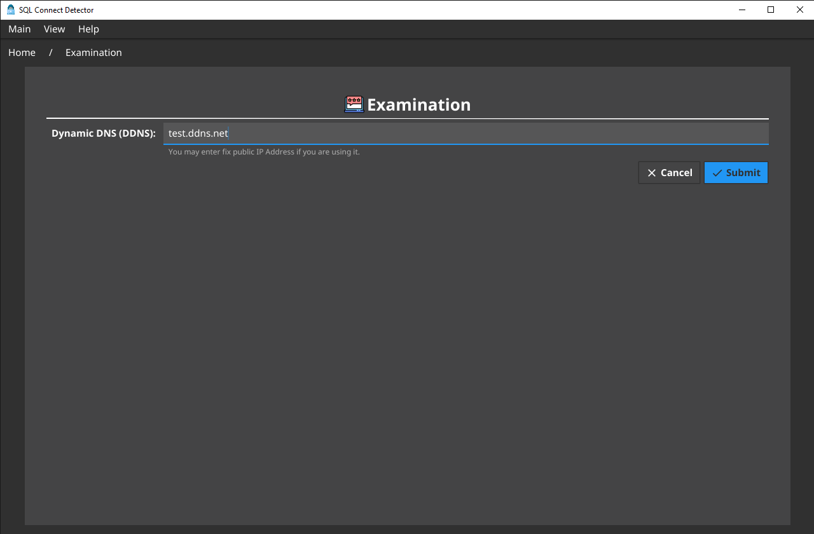

- In the next windows, a report will show you if your server is eligible for the setup. 
- Your server is ready to setup if **the report has every fields in <text style="color: #43a047">green</text>**.
- Suggestions will be given based on the report result.

	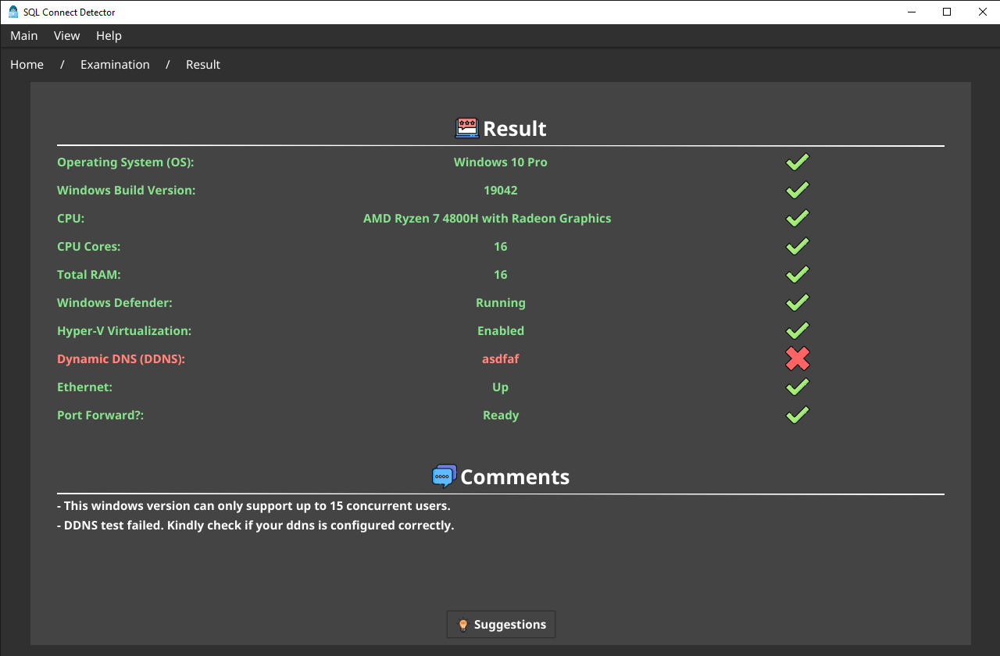

### Troubleshooting
- You may enter your **dynamic DNS (DDNS)** / **fix Public IP Address** here.
- You may also change the port forwarded if you are not using the default.
	
	
	
- In the next windows, a report will show you what issue your server is facing.
- Your server's state is healthy if **the report has no field marked in <text style="color:#f44336">red</text>**.
- Suggestions / solutions will be given based on the report.

	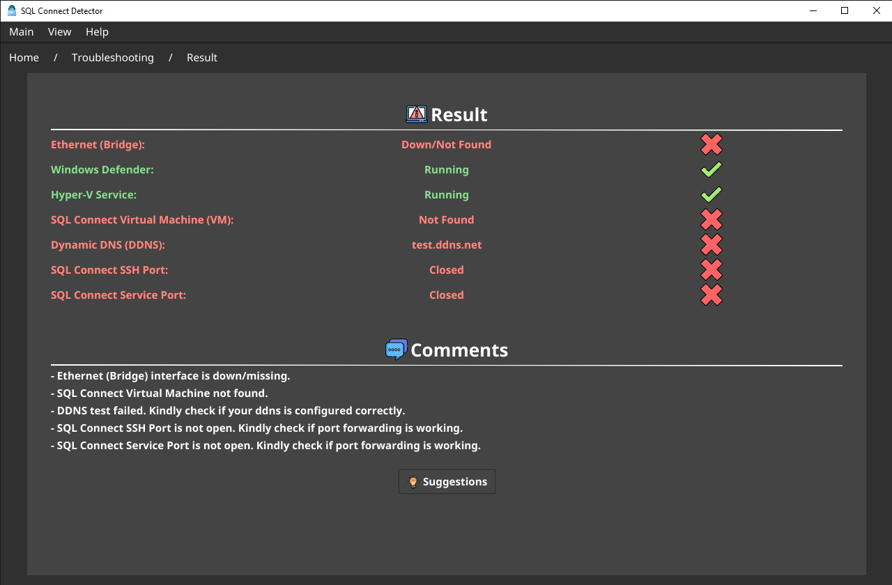

### Issue: Virus/Unwanted Software
- Sometimes Windows Defender may flag detector as virus/unwanted software. 

	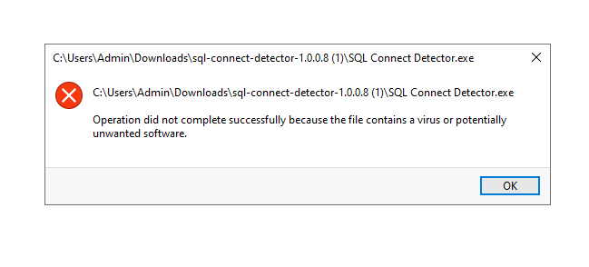

- To resolve this, first, go to `Windows Settings > Update & Security > Windows Security > Virus & Threat Protection`.
- The interface would show a threat found and is similar to the one below.

	

- Click on the threat, and allow it on device. After this you should be able to open SQL Connect Detector.

	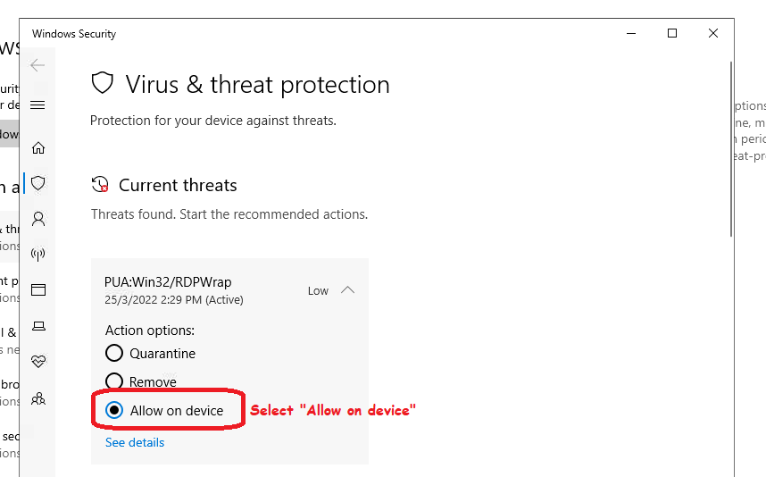

---
## Dynamic DNS (DDNS)
1. If you don't have a DDNS, you may get one free from **DuckDNS**.
2. Firstly, visit [Duck DNS](https://www.duckdns.org/).

	

3. Next, sign in using your gmail.
	
	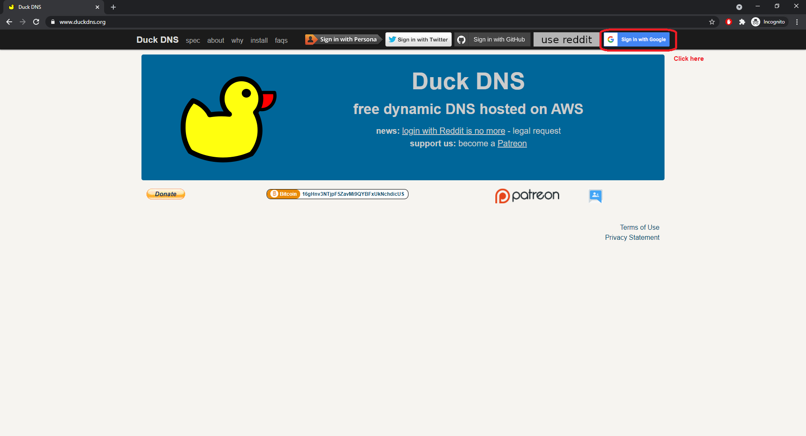

4. Once you have sign in, you will reach the following page. 
5. Create a DDNS that you like. 

	
	
6. You will end up with a screen similar to the one below. Next, click on **install**.

	
	
7. Select `windows-gui`, and choose the DDNS you created just now.
	
	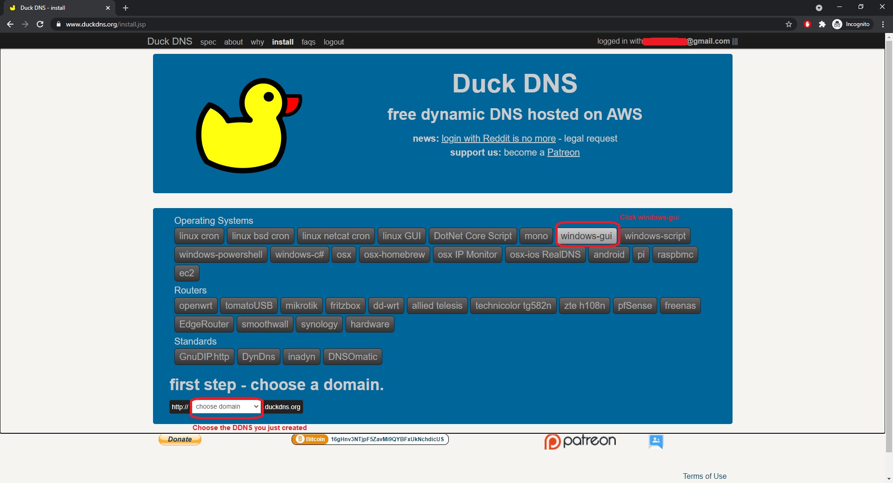
	
8. A guide will be shown similar to the screen below. Follow the steps.

	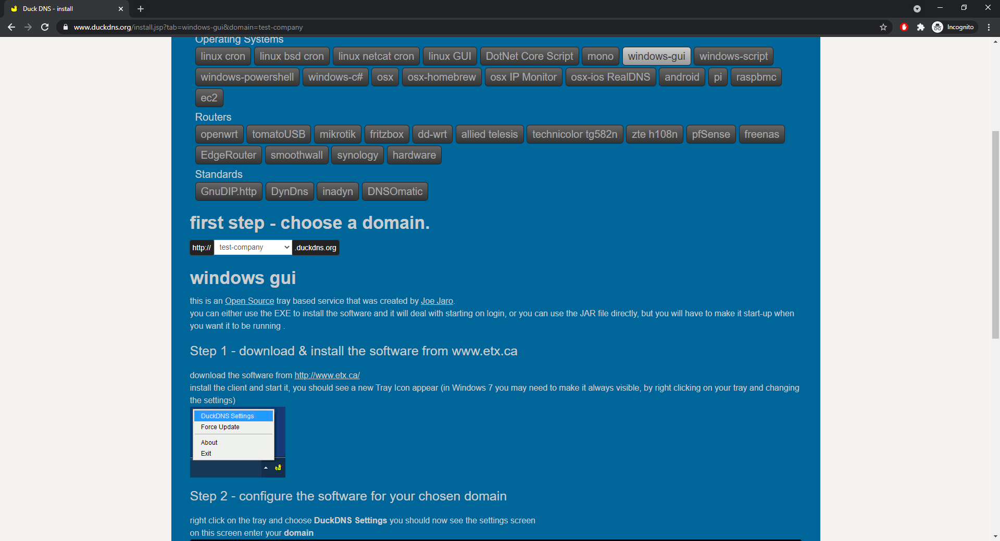
	
9. Lastly, write the ddns you just created in the checklist prepared. (Ex. `test-company.duckdns.org`)

## Windows User Access Rights
[Video Tutorial](https://youtu.be/H78QOIUPd7k)
### Retrieve Windows Users
1. Search `Computer Management`.
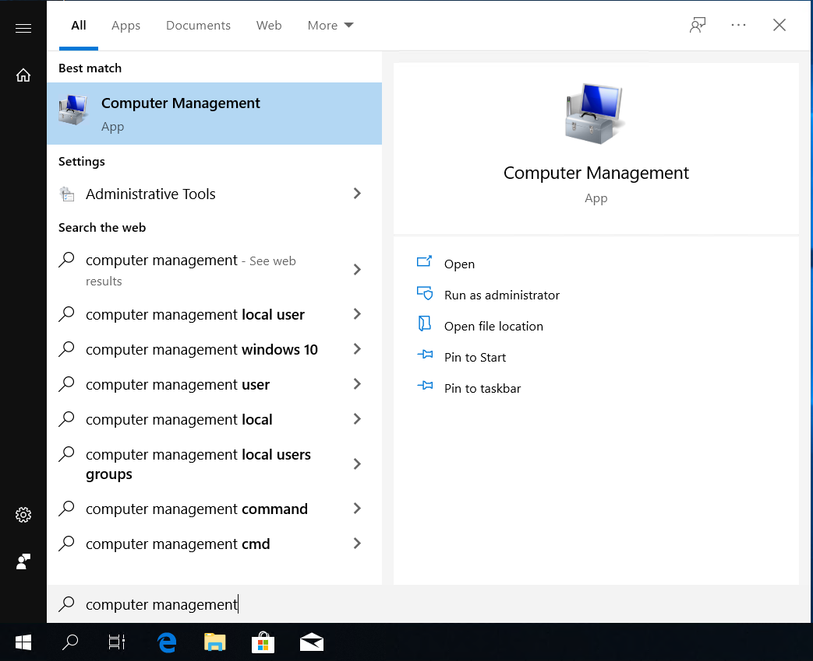
2. Click `Local Users and Groups > Users`. (Look for username with your company name, those are the users created for SQL Connect - private)
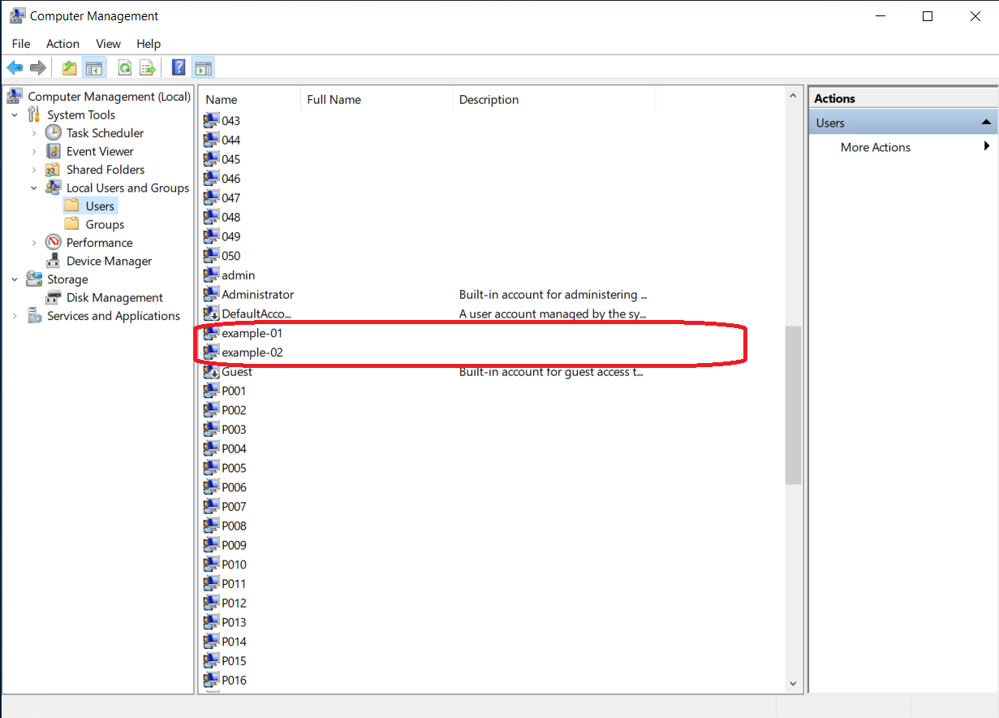

### Case Study
#### Environment
1. Two emails registered.
	- example1@gmail.com (has access to windows user example-01)
	- example2@gmail.com (has access to windows user example-02)
2. Two databases in the server.
	- db1
	- db2

#### Assumptions
1. example1@gmail.com can only access to db1.
2. example2@gmail.com can only access to db2.

#### Solutions
- Create two dcf file. (`db1.dcf` has link to db1, `db2.dcf` has link to db2)

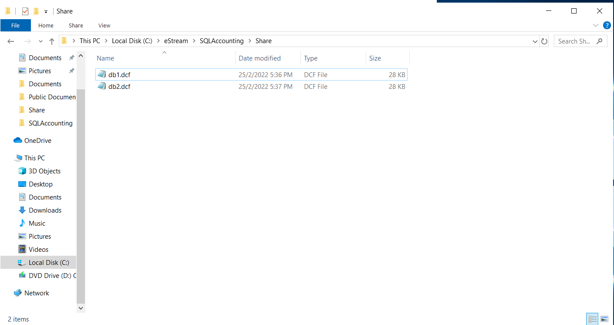


- Right click on `db1.dcf`, select `Properties`.

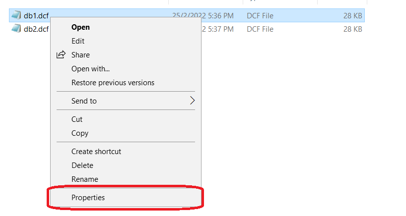

- Go to `Security`, select `Advanced`.

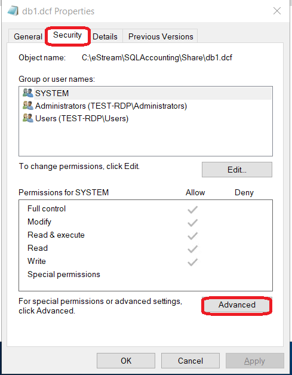

- Click `Disable Inheritance`. (If the button shows `Enable Inheritance`, you may skip this step)


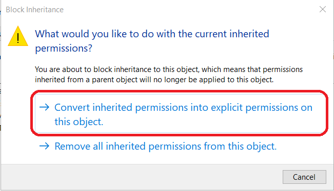


- Remove principal except `Administrators` and `SYSTEM`.


- Next, click `Add`, click `Select a Principal`.

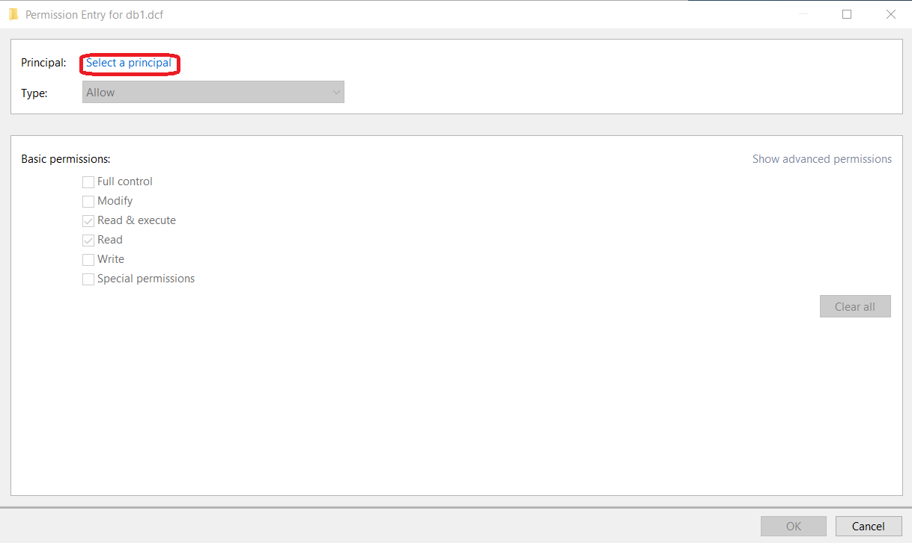

- Search for the windows username you wish. In this case we will search for `example-01`. (Click `Check Names` after key in window username)


- Configure the permission to `Read` and `Read & execute` only, select `OK`.

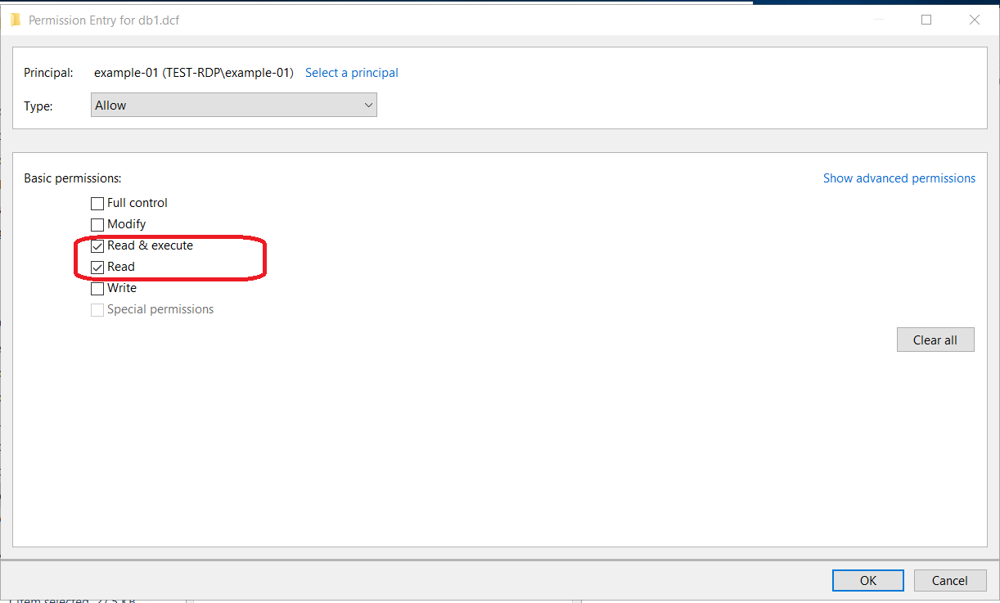

- Repeat the `Add` procedure if you want more users to use this dcf. Press `Apply` and `OK` if there is no more.


- Repeat **step 2** to **step 9** for `db2.dcf`.

#### Notes
1. If you are unsure of which window user the emails have access to, feel free to call our support to get the email:windows user mapping.
	
---
## Troubleshooting 
### Bridge Network Failure
1. Visit `Control Panel > Network and Internet > Network and Sharing Center`
2. Click `Change Adapter Options`

	

3. Look for adapters named `Ethernet` and `Ethernet (Bridge)`

	

4. Right click and check the properties of each adapter.
5. For `Ethernet`, it should have the following **check** (Example shown below):
	- Microsoft LLDP Protocol Driver
	- Hyper-V Extensible Virtual Switch

	

6. For `Ethernet (Bridge)`, it should be the following **uncheck** (Example shown below):
	- Microsoft Network Adapter Multiplexor Protocol
	- Hyper-V Extensible Virtual Switch

	

---
### Hyper-V Service Not Running
1. Open `Services` (search `services` in Windows search)
2. Look for a service called `Hyper-V Host Compute Service`
3. If the service status is not **Running**, right click and start it.

	

---
### SQL Connect Virtual Machine Not Running
1. Open `Hyper-V Manager` (search `hyper-v` in Windows search)

	

2. Look for a virtual machine with the name **SQL Connect**. 
3. Make sure it's running.
4. If it's state is some state other than running, right click on the virtual machine, and click *Start*.

	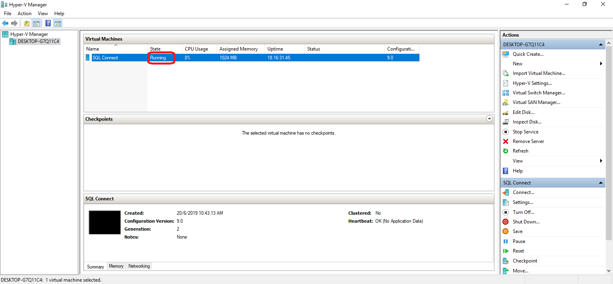
	
---
### Windows Defender Not Running
1. If the service is not running, you have probably install **third party antivirus** in your server.
2. Antivirus like Kaspersky, Avira, Avast and so on are considered as third party antivirus.
3. These antivirus acts differently in different operation and the outcome is unpredictable.
4. What you can do is, uninstall it and restart your server. If the issue persist after uninstall, kindly contact our dealer / support.

